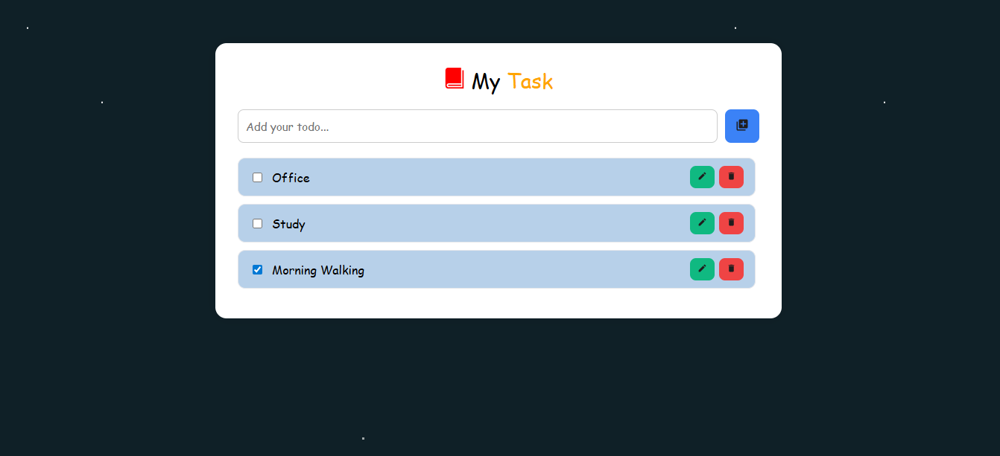

# React ToDo-App (With Vite)

A simple and elegant To-Do List built using **React + Vite** .
- Add tasks
- Delete tasks
- Edit tasks (inline)
- Mark tasks as completed
- Uses functional components, state & props

**##src**
App.jsx – main component with state & logic

**##Components**
Header.jsx – title and subtitle
TodoList.jsx – displays all tasks
TodoItem.jsx – single task card

**##Project Structure**
src/
│
├── App.jsx
├── components/
│   ├── Header.jsx
│   ├── TodoList.jsx
│   └── TodoItem.jsx
│
└── assets/
    └── screenshot.png

**##Features**
Add new To-Do
Delete To-Do
Mark complete
Edit To-Do
Styled with sky twinkle moving star animationn UI

**## Run Program**
1.Install dependencies
npm install

2.Run development server
npm run dev

3.Open browser
http://localhost:5173/

**## Technologies Used**
- React
- Vite
- CSS3

**## Author**
Developed by **GAUTAM VAISHNAV**

**Github link** :- 
https://github.com/gautam-vaishnav016/ToDo-APP

**Project Layout Screenshot**
## 📸 Preview

